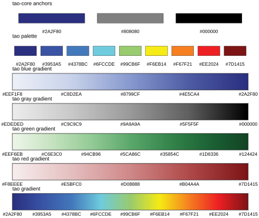
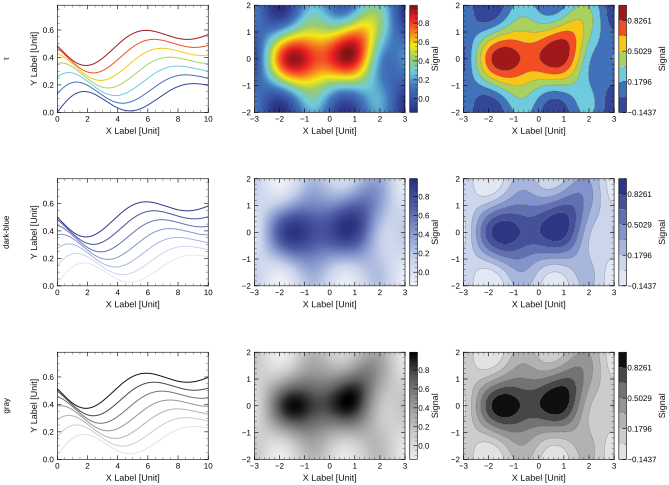
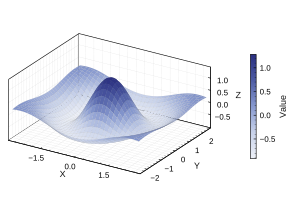
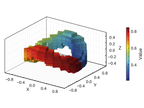
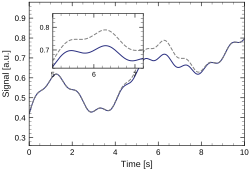

# τ Style

<p align="center">
  <picture>
    <source media="(prefers-color-scheme: dark)" srcset="assets/logo-style.svg">
    <source media="(prefers-color-scheme: light)" srcset="assets/logo-style-light.svg">
    
  </picture>
</p>

<p align="center">
  
  
  
  
  
</p>

<p align="center">
  <a href="#english-version">English Version</a>
</p>

<a id="chinese-version"></a>

`τ Style` 是面向科研绘图和科研报告生成的个人视觉风格 Skill。Codex 或 Claude Code 可在生成图表、slides 和相关科研视觉材料时调用。

## 范围

- 科研绘图：默认 Python/Matplotlib；规则可迁移到 R、MATLAB、Julia、C++/ROOT、Plotly 和 LaTeX/pgfplots。
- 科研报告：支持 Beamer；选择 Beamer 时使用 [`yangtaogit/tao-slides`](https://github.com/yangtaogit/tao-slides) 模板。
- 学术文档：支持 [`yangtaogit/tao-document`](https://github.com/yangtaogit/tao-document/) 模板。
- 规则文件：`references/style-profile.md`、`references/scientific-plotting.md`、`references/scientific-slides.md`、`references/academic-documents.md`。Python helper：`scripts/apply_tao_style.py`。

## 科研绘图风格

### 后端与输出

- 默认后端：Python/Matplotlib。
- 正式输出：优先 SVG/PDF 等矢量格式。
- 默认导出的 SVG/PDF 应保证跨环境打开时字体显示一致：SVG 默认将文字转为 path；PDF 默认嵌入字体。只有明确需要可编辑文字时，才保留 SVG/PDF 文本并确认目标环境具备对应字体。

### 字体与字号

- 英文字体首选 Helvetica；中文字体首选宋体；数学公式字体使用 Computer Modern。
- 普通坐标轴标题、tick、legend、annotation 尽量不用 Matplotlib mathtext。
- 坐标轴标题使用 `9 pt`；tick 数字使用 `8 pt`；legend 使用 `8 pt`。

### 坐标框尺寸与比例

- 单图科研图固定黑色 XY 坐标框的物理尺寸，不固定整个 canvas。
- 默认参考尺寸为 `1.8 in`，默认比例为 `3:2`，即坐标框为 `2.7 in × 1.8 in`。
- 横向和方形常用比例保持同一坐标框高度 `1.8 in`：`1:1 = 1.8 in × 1.8 in`，`3:2 = 2.7 in × 1.8 in`，`5:3 = 3.0 in × 1.8 in`。
- 竖向比例视为横向尺寸的旋转，保持同一坐标框宽度 `1.8 in`：`2:3 = 1.8 in × 2.7 in`，`3:5 = 1.8 in × 3.0 in`。
- 常用比例为 `1:1`、`3:2`、`5:3`、`2:3`、`3:5`。
- 横向/方形单图导出 canvas 高度默认固定；无右侧外置元素的竖向单图导出 canvas 宽度默认固定；左侧布局边距初始值为 `0.42 in`。
- 竖向单图如果带右侧 colorbar 或外置 legend，保持 XY 坐标框宽度固定，允许 canvas 向右扩展，避免 colorbar 和 tick label 重叠。
- 导出 canvas 可在非固定方向上随 tick label、轴标题、外置 legend、colorbar、annotation 自适应扩展；XY 坐标框尺寸保持不变。
- 多图排列不受单图尺寸/比例限制，由子图数量、panel 坐标框、排版和数据关系决定。
- 论文栏宽、slides 占位、poster panel 或报告版式有固定宽度时，先确认目标尺寸。

### 坐标轴、tick 与标签

- 默认封闭黑色坐标框；上下左右 spine 可见。
- tick 向内；顶部和右侧也显示 tick。
- 坐标轴线宽为 `0.6 pt`；主 tick 线宽为 `0.6`；副 tick 线宽为 `0.3`。
- 默认不使用 grid。
- 单位格式：`Quantity [Unit]`，例如 `Bias Voltage [V]`、`Current [A]`。
- base-10 log 主刻度使用普通文本上标，如 `10⁻⁶`；不用 Matplotlib mathtext；副 tick 默认保留。

### 三维坐标

- 三维科研图使用 Matplotlib 默认 3D 坐标框、pane 和 grid，包括 `X`、`Y`、`Z` 坐标轴。
- 默认透视投影：`projection="persp"`；三面 pane 背景为 `#F2F2F2`。
- 3D 网格只显示主 tick 对应的灰色点线，颜色为 `#9E9E9E`，线型为 dotted `":"`，线宽为 `0.2 pt`；不额外添加 pane 边界线或手动画框。
- 3D tick 方向与 2D 坐标统一为向内；Matplotlib 3D 中使用 `inward_factor=0.0`、`outward_factor=0.2`。
- 3D 间距：`tick_pad=-3.0`，`labelpad=-4.0`；字体、字号和普通文本规则使用 τ Style。
- 已知单位时继续使用方括号格式，例如 `X Position [mm]`。
- 三维空间坐标之外的数值可用颜色梯度表示；colorbar 置于图框外右侧。当前 3D example 使用 `pad=0.16`、`fraction=0.035`、`shrink=0.72`。
- 三维图不受二维单图 XY 坐标框尺寸规则约束。

### 颜色

- 默认偏好冷色调、暗蓝、黑色和灰色。
- 核心颜色锚点为 deep blue `#2A2F80`、black `#000000`、gray `#808080`；普通多系列图优先使用这三色，并保持这个顺序。muted red `#B04A4A` 仅在需要明确强调时使用。
- 多条曲线和多个直方图超过三个普通系列时才加入扩展色。扩展色也应保持合理顺序，优先补浅灰 `#BDBDBD`，再补蓝色扩展 `#4378BC`、`#6FCCDE`，仍不够时再用 darker blue `#3953A5`。没有明确强调语义时不使用红色。有序数据默认优先使用暗蓝梯度或灰度梯度；暗蓝梯度/colorbar 以 deep blue `#2A2F80` 为基础演变。
- τ 的色板用于需要更强视觉区分或专用 colorbar 的场景：`#2A2F80`、`#3953A5`、`#4378BC`、`#6FCCDE`、`#99CB6F`、`#F6EB14`、`#F67F21`、`#EE2024`、`#7D1415`。
- colorbar 默认置于坐标框外右侧，竖向布局，黑色外框线宽与坐标轴一致；竖向单图带右侧 colorbar 时，保持坐标框宽度固定并让 canvas 向右扩展，避免重叠。

### 线条、marker 与 error bar

- 普通连续曲线和拟合曲线默认 line width 为 `1.0 pt`。
- 二维 XY 数据点密集时优先只用线条，避免 marker 拥挤。
- 多条拟合曲线用颜色和线型区分；线型顺序为 solid、dashed、dotted、dash-dot。
- 默认 marker size 为 `3.2 pt`，marker edge width 为 `0.7 pt`。
- 默认 error bar line width 为 `0.6 pt`，cap size 为 `1.6 pt`。

### Legend

- 框内 legend 不加边框。
- 曲线很多或遮挡数据时，legend 置于图框外右侧，优先竖向单列，黑色 `1.0 pt` 边框。
- 框外单列 legend 超出图框高度时，条目均分为多列。

### 直方图

- 绘制前询问 y 轴使用 raw `Count` 还是归一化 `Probability Density [1/Unit]`。
- 默认样式为阶梯状 bin 外轮廓加浅填充色；外轮廓沿 bin 边界绘制，不连接 bin 中点。
- 只有 bin 宽较大、统计量较低或需要拟合并展示每个 bin 的不确定度时，才使用 marker + errorbar。

## 学术报告 / Slides

- 生成科研 slides 且未指定输出格式时，先询问是否使用 Beamer。
- 使用 Beamer 时，基于 [`yangtaogit/tao-slides`](https://github.com/yangtaogit/tao-slides) 模板。
- 生成前获取或定位模板，并检查 README、示例、主题文件和构建命令。
- 在模板副本或新的报告项目目录中生成内容，不直接修改模板源，除非明确要求修改模板。
- slides 中的新科研图仍遵守 τ Style 科研绘图规则。

## 学术文档 / Documents

- 生成学术文档、manuscript、report、note 或 handout 且未指定模板时，先询问是否使用 [`yangtaogit/tao-document`](https://github.com/yangtaogit/tao-document/) 模板。
- 使用该模板时，生成前获取或定位模板，并检查 README、示例、样式文件、资源文件和构建命令。
- 在模板副本或新的文档项目目录中生成内容，不直接修改模板源，除非明确要求修改模板。
- 文档中新增科研图仍遵守 τ Style 科研绘图规则。

## 绘图风格样例

### 色系规则总览



<table width="100%">
  <tr>
    <td colspan="2">色板展示</td>
  </tr>
  <tr>
    <td colspan="2"></td>
  </tr>
  <tr>
    <td width="50%">三维曲面图</td>
    <td>4D 数据颜色映射</td>
  </tr>
  <tr>
    <td></td>
    <td></td>
  </tr>
  <tr>
    <td width="50%">XY 离散数据与拟合</td>
    <td>高斯分布样本误差棒</td>
  </tr>
  <tr>
    <td></td>
    <td></td>
  </tr>
  <tr>
    <td width="50%">对数坐标</td>
    <td>多曲线与外置 Legend</td>
  </tr>
  <tr>
    <td></td>
    <td></td>
  </tr>
  <tr>
    <td width="50%">多个直方图填充</td>
    <td>曲线局部放大</td>
  </tr>
  <tr>
    <td></td>
    <td></td>
  </tr>
</table>

## 安装

安装目标为 AI 工具 `skills` 目录下的 `tao-style/` 文件夹。

克隆仓库：

```bash
git clone https://github.com/yangtaogit/tao-style.git
cd tao-style
```

安装到 Codex：

```bash
python3 scripts/install_skill.py --target codex --mode copy --force
```

安装到 Claude Code：

```bash
python3 scripts/install_skill.py --target claude-code --mode copy --force
```

同时安装或更新 Codex 和 Claude Code：

```bash
python3 scripts/install_skill.py --target all --mode copy --force
```

自定义 Skill 目录：添加 `--skills-dir /path/to/skills`。预览操作：添加 `--dry-run`。

## 更新

copy 安装：

```bash
git pull
python3 scripts/install_skill.py --target all --mode copy --force
```

symlink 安装：更新本仓库即可。

## 使用

显式调用：

```text
请用 $tao-style 生成这张科研图。
```

Claude Code 可用 `/tao-style` 调用。未显式调用但任务涉及科研绘图时，AI 应先询问是否采用 τ Style。

## English Version

<a id="english-version"></a>

`τ Style` is a personal visual-style Skill for scientific plots and scientific reports. Codex or Claude Code can apply it when generating plots, slides, and related scientific visual materials.

## Scope

- Scientific plotting defaults to Python/Matplotlib. Rules are portable to R, MATLAB, Julia, C++/ROOT, Plotly, and LaTeX/pgfplots.
- Scientific reports support Beamer. When Beamer is selected, use the [`yangtaogit/tao-slides`](https://github.com/yangtaogit/tao-slides) template.
- Academic documents support the [`yangtaogit/tao-document`](https://github.com/yangtaogit/tao-document/) template.
- Rule files: `references/style-profile.md`, `references/scientific-plotting.md`, `references/scientific-slides.md`, `references/academic-documents.md`. Python helper: `scripts/apply_tao_style.py`.

## Scientific Plotting Rules

### Backend and Output

- Default backend: Python/Matplotlib.
- Formal output: prefer SVG/PDF vector formats.
- Exported SVG/PDF files should be font-stable across viewing environments by default: SVG text is converted to paths, and PDF fonts are embedded. Keep editable SVG/PDF text only when explicitly needed and after confirming that the target environment has the required fonts.

### Fonts and Sizes

- English text should prefer Helvetica; Chinese text should prefer Songti; mathematical expressions use Computer Modern.
- Regular axis labels, tick labels, legends, and annotations should avoid Matplotlib mathtext when possible.
- Axis labels use `9 pt`; tick labels use `8 pt`; legends use `8 pt`.

### Axes Box Size and Aspect Ratio

- Single-panel scientific plots fix the physical size of the black XY axes box, not the whole canvas.
- The default reference size is `1.8 in`; with the default `3:2` ratio, the axes box is `2.7 in × 1.8 in`.
- Landscape and square ratios keep the same default axes-box height `1.8 in`: `1:1 = 1.8 in × 1.8 in`, `3:2 = 2.7 in × 1.8 in`, and `5:3 = 3.0 in × 1.8 in`.
- Portrait ratios are treated as rotated landscape sizes and keep the same default axes-box width `1.8 in`: `2:3 = 1.8 in × 2.7 in` and `3:5 = 1.8 in × 3.0 in`.
- Common ratios are `1:1`, `3:2`, `5:3`, `2:3`, and `3:5`.
- For landscape/square single-panel figures, the exported canvas height is fixed by default. For portrait single-panel figures without right-side external elements, the exported canvas width is fixed by default. The initial left layout margin is `0.42 in`.
- If a portrait single-panel figure has a right-side colorbar or outside legend, keep the XY axes-box width fixed and allow the canvas to expand rightward to avoid overlap.
- The exported canvas may expand in the non-fixed direction for tick labels, axis labels, outside legends, colorbars, and annotations; the XY axes-box size remains fixed.
- Multi-panel figures are not constrained by this single-panel rule; size them by panel count, layout, and data relationships.
- Confirm target size first when a paper column, slide placeholder, poster panel, or report layout has a fixed width.

### Axes, Ticks, and Labels

- Use a closed black axis box by default; all four spines are visible.
- Ticks point inward; top and right ticks are shown.
- Axis line width is `0.6 pt`; major tick width is `0.6`; minor tick width is `0.3`.
- Grid lines are off by default.
- Units use square brackets, such as `Bias Voltage [V]` and `Current [A]`.
- Base-10 log major ticks should be displayed as plain-text superscripts such as `10⁻⁶`, not Matplotlib mathtext. Minor ticks should remain visible unless they become too crowded.

### 3D Axes

- 3D scientific plots should use Matplotlib's default 3D coordinate box, panes, and grid by default, including the `X`, `Y`, and `Z` axes.
- Use perspective projection by default, `projection="persp"`. Keep the three light-gray 3D pane backgrounds with pane color `#F2F2F2`.
- Show only major-tick grid lines on 3D panes, using gray dotted lines with color `#9E9E9E`, linestyle `":"`, and linewidth `0.2 pt`. Do not add extra pane boundary lines or manual frames.
- Match 2D axes by using inward ticks. In Matplotlib 3D, use `inward_factor=0.0` and `outward_factor=0.2`.
- Use compact 3D label spacing: `tick_pad=-3.0` and `labelpad=-4.0`. Apply τ Style typography: `9 pt` axis labels, `8 pt` tick labels, and ordinary text for regular coordinate labels instead of mathtext.
- When units are known, keep the square-bracket format, such as `X Position [mm]`.
- Use color gradients for scalar values in addition to 3D spatial coordinates; place the colorbar outside the right side of the axes with more padding than 2D plots. The current 3D examples use `pad=0.16`, `fraction=0.035`, and `shrink=0.72`.
- 3D figures are not constrained by the single-panel 2D XY axes-box size rule. Choose the canvas according to the view angle, data body, and right-side colorbar.

### Colors

- The default palette favors cool tones, dark blue, black, and gray.
- The core color anchors are deep blue `#2A2F80`, black `#000000`, and gray `#808080`; ordinary multi-series plots should use these three first and keep this order. Muted red `#B04A4A` is used only for explicit emphasis.
- Add extension colors only when there are more than three ordinary series. Keep extension colors in a reasonable order, prioritizing light gray `#BDBDBD` first, then blue extensions `#4378BC`, `#6FCCDE`, then darker blue `#3953A5` if still needed. Do not use red without explicit emphasis semantics. For ordered data, prefer dark-blue or grayscale gradients by default; the dark-blue gradient/colorbar is derived from deep blue `#2A2F80`.
- The τ palette is available when stronger visual separation or a dedicated colorbar is needed: `#2A2F80`, `#3953A5`, `#4378BC`, `#6FCCDE`, `#99CB6F`, `#F6EB14`, `#F67F21`, `#EE2024`, `#7D1415`.
- Colorbars should be placed outside the right side of the corresponding axes, use a vertical layout, and keep a black outline width matching the axes box.

### Lines, Markers, and Error Bars

- Regular continuous curves and fitted curves default to a line width of `1.0 pt`.
- For dense two-dimensional XY data, prefer line-only plots to avoid overcrowded markers.
- Multiple fitted curves should be distinguished by both color and line style, with the default order solid, dashed, dotted, and dash-dot.
- Default marker size is `3.2 pt`; marker edge width is `0.7 pt`.
- Default error-bar line width is `0.6 pt`; cap size is `1.6 pt`.

### Legends

- Legends inside the plotting box should not have a frame.
- If many curves are present or the legend overlaps the data, place the legend outside the right side of the axes, preferably as a vertical single column, with a black `1.0 pt` frame matching the axis box.
- If an outside single-column legend exceeds the height of the axes box, split the entries evenly into multiple columns to keep the legend compact.

### Histograms

- Before plotting, ask whether the y-axis should be raw `Count` or normalized `Probability Density [1/Unit]`.
- The default histogram style is a stepped bin outline with a light fill, meaning the outline follows bin edges. It is not a line connecting bin centers.
- Use marker + errorbar only for special cases such as wide bins, low statistics, or fitted binned data with uncertainty shown for each bin.

## Scientific Report / Slides Style

- When generating scientific slide reports and no output format is specified, ask whether to use Beamer.
- If Beamer is used, base the report on the `yangtaogit/tao-slides` template: `https://github.com/yangtaogit/tao-slides`.
- Before generating, fetch or locate the template and inspect its README, examples, theme files, and build commands. Do not assume template filenames or build commands without checking.
- Generate content in a copied template or a new report project directory. Do not directly modify the template source unless explicitly requested.
- New scientific figures used in slides should still follow the τ Style scientific plotting rules.

## Academic Documents Style

- When generating an academic document, manuscript, report, note, or handout and no template is specified, ask whether to use the [`yangtaogit/tao-document`](https://github.com/yangtaogit/tao-document/) template.
- If `tao-document` is used, fetch or locate the template and inspect its README, examples, style files, assets, and build commands before generating.
- Generate content in a copied template or a new document project directory. Do not directly modify the template source unless explicitly requested.
- New scientific figures used in documents should still follow the τ Style scientific plotting rules.

## Plotting Examples

### Color System Overview


<table width="100%">
  <tr>
    <td colspan="2">Palette Display</td>
  </tr>
  <tr>
    <td colspan="2"></td>
  </tr>
  <tr>
    <td width="50%">3D Surface</td>
    <td>4D Data Color Mapping</td>
  </tr>
  <tr>
    <td></td>
    <td></td>
  </tr>
  <tr>
    <td width="50%">XY Data and Linear Fit</td>
    <td>Gaussian Error Bar</td>
  </tr>
  <tr>
    <td></td>
    <td></td>
  </tr>
  <tr>
    <td width="50%">Log Axis</td>
    <td>Many Curves with External Legend</td>
  </tr>
  <tr>
    <td></td>
    <td></td>
  </tr>
  <tr>
    <td width="50%">Multiple Filled Histograms</td>
    <td>Inset Zoom</td>
  </tr>
  <tr>
    <td></td>
    <td></td>
  </tr>
</table>

## Installation

Install the Skill as a `tao-style/` folder under the target AI tool's `skills` directory.

Clone the repository:

```bash
git clone https://github.com/yangtaogit/tao-style.git
cd tao-style
```

Install to Codex:

```bash
python3 scripts/install_skill.py --target codex --mode copy --force
```

Install to Claude Code:

```bash
python3 scripts/install_skill.py --target claude-code --mode copy --force
```

Install or update both Codex and Claude Code:

```bash
python3 scripts/install_skill.py --target all --mode copy --force
```

Custom Skill directory: add `--skills-dir /path/to/skills`. Dry run: add `--dry-run`.

## Update

copy install:

```bash
git pull
python3 scripts/install_skill.py --target all --mode copy --force
```

symlink install: update this repository.

## Usage

Explicit call:

```text
Please use $tao-style to generate this scientific figure.
```

Claude Code can call `/tao-style`. If the task involves scientific plotting but does not explicitly call the Skill, the AI should ask whether to apply τ Style.
