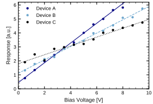
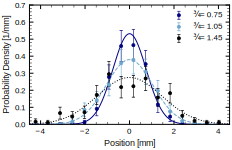
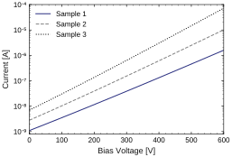
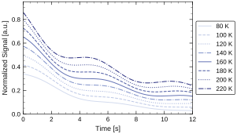
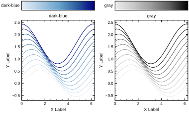
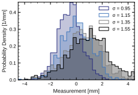

# τ Style

<p align="center">
  
</p>
`τ Style` 是一个个人 AI Skill，用来保存和复用 τ 的作图与视觉格式偏好。当前已经维护科研绘图部分，并开始维护科研报告 / slides 风格；后续可以继续扩展到文档、示意图等其它输出风格。

这个仓库是开发版 Skill 仓库，放在 WSL 下是为了方便调用 Python、C++ 等环境快速生成测试图。真正安装到 Codex 或 Claude Code 时，可以把它复制或链接到目标 `skills` 目录。

## 当前范围

当前科研绘图部分暂时完成，科研数据绘图默认使用 Python/Matplotlib；风格规则保持语言无关，后续可迁移到 R、MATLAB、Julia、C++/ROOT、Plotly 或 LaTeX/pgfplots。

科研报告 / slides 部分刚开始维护。生成 slides 报告时，如果用户没有指定格式，Skill 应先询问是否使用 Beamer；如果使用 Beamer，应基于 `yangtaogit/tao-slides` 模板生成报告。

更完整的规则在 `references/style-profile.md`、`references/scientific-plotting.md` 和 `references/scientific-slides.md` 中维护；Python helper 在 `scripts/apply_tao_style.py` 中维护。

## 已确认科研绘图规则

- 字体：英文首选 Helvetica；中文首选宋体；数学公式字体使用 Computer Modern。普通坐标轴标题、tick、legend、annotation 尽量不用数学字体，以保持字体统一。
- 字号：坐标轴标题 `9 pt`；tick 数字 `8 pt`；legend `8 pt`。
- 坐标轴：默认封闭黑色坐标框；上下左右 spine 可见；tick 向内；顶部和右侧也显示 tick；坐标轴线宽 `1.0 pt`；主 tick 线宽 `1.0`；副 tick 线宽 `0.5`；默认不使用 grid。
- 轴标题和单位：单位使用方括号格式 `Quantity [Unit]`，例如 `Bias Voltage [V]`、`Current [A]`。
- 图像尺寸和比例：单图科研图默认物理宽度 `3.6 in`，默认比例 `5:3`，即 `3.6 in × 2.16 in`；常用比例是 `1:1`、`3:2`、`5:3`。多图排列画布不受这个单图尺寸/比例限制，应根据子图数量、排版和数据关系决定。如果目标媒介有明确最终宽度，例如论文栏宽、slides 占位、poster panel 或报告版式，应先确认目标宽度再设定 `figsize`，避免后期大幅缩放。
- Log 坐标：base-10 log 主刻度显示为 `10⁻⁶` 这类普通文本上标形式，不使用 Matplotlib mathtext；副 tick 保持可见，除非过于拥挤。
- 颜色：偏好冷色调、暗蓝、柔和蓝、黑色、灰色。当前主色板为 Navy `#000080`、soft blue `#6CA6CD`、black `#000000`、gray `#808080`，muted red `#B04A4A` 仅作为低优先级强调色。
- 颜色梯度：多曲线或有序数据优先使用暗蓝梯度或灰度梯度，避免彩虹色或高饱和多色梯度。
- Marker 和 error bar：默认 marker size `3.2 pt`，marker edge width `0.7 pt`；error bar line width `0.6 pt`，cap size `1.6 pt`。
- 线条和拟合：普通连续曲线和拟合曲线默认 line width `1.0 pt`；二维 XY 数据点很密集时优先只用线条表示，避免 marker 挤在一起；多条拟合曲线用颜色加线型区分，默认线型顺序为 solid、dashed、dotted、dash-dot。
- Legend：框内 legend 不加边框；曲线很多或遮挡数据时放到图框外右侧，竖向单列排列，并使用与坐标轴一致的黑色 `1.0 pt` 边框。
- 直方图：绘制前必须询问 y 轴使用 raw `Count` 还是归一化 `Probability Density [1/Unit]`。默认使用阶梯状 bin 外轮廓加浅填充色，也就是沿 bin 边界画直方图外框，不是连接各个 bin 中点的折线；只有 bin 宽较大、统计量较低或需要拟合并展示每个 bin 的不确定度时，才使用 marker + errorbar 或 bin-center line 形式。
- 输出：线图和科研图优先保存矢量格式；README/web 预览 SVG 可将文字转路径以保证跨机器显示一致；正式可编辑 SVG/PDF 应保留文字但需要确认目标环境有对应字体。

## 已确认科研报告 / Slides 规则

- 生成科研 slides 报告时，如果没有指定输出格式，应先询问是否使用 Beamer。
- 如果使用 Beamer，应基于 `yangtaogit/tao-slides` 模板生成报告：`https://github.com/yangtaogit/tao-slides`。
- 生成前应先获取或定位模板，检查模板的 README、示例、主题文件和构建命令，再按实际结构生成；不要凭空假设模板文件名或命令。
- 应在模板副本或新的报告项目目录中生成内容，不直接修改模板源，除非明确要求修改模板。
- slides 中的新科研图仍应遵守 τ Style 科研绘图规则。

## 绘图风格样例

下面的 SVG 图片由 `example/` 中的脚本生成，用来直观看当前科研绘图风格是否符合预期。重新生成全部样例：

```bash
for script in example/*.py; do python3 "$script"; done
```

README 中展示的 SVG 会把文字保存为矢量路径，以避免浏览器或不同机器缺少字体时改变显示效果。正式需要后期编辑文字的 SVG 可以保留 editable text，但要确认目标环境安装了 Helvetica/兼容字体和数学字体。

<table>
  <tr>
    <td>XY 离散数据与拟合</td>
    <td>Gaussian Error Bar</td>
  </tr>
  <tr>
    <td></td>
    <td></td>
  </tr>
  <tr>
    <td>Log 坐标</td>
    <td>多曲线与外置 Legend</td>
  </tr>
  <tr>
    <td></td>
    <td></td>
  </tr>
  <tr>
    <td>颜色梯度</td>
    <td>多个直方图填充</td>
  </tr>
  <tr>
    <td></td>
    <td></td>
  </tr>
</table>

## 安装

安装目标是某个 AI 工具 `skills` 目录下的 `tao-style/` 文件夹。脚本支持 Codex 和 Claude Code 两种目标，也支持一次同步到两者。

- `copy`：复制可安装的 Skill 文件，适合从 WSL 仓库安装到 Windows Codex 目录，最稳妥。
- `symlink`：创建符号链接，适合同一文件系统内开发调试；后续改仓库即可立即更新。

安装目标：

- `codex`：默认安装到 `$CODEX_HOME/skills`，如果没有设置 `CODEX_HOME`，则安装到 `~/.codex/skills`。
- `claude-code`：默认安装到 `~/.claude/skills`，对应 Claude Code 个人 Skills。
- `all`：一次安装或更新到 Codex 和 Claude Code 的默认目录。

在本机 WSL 仓库中运行：

```bash
cd /home/tao/git_repository/tao-style
```

安装到 Windows Codex Desktop 的 skills 目录：

```bash
python3 scripts/install_skill.py --target codex --mode copy --skills-dir /mnt/c/Users/yangt/.codex/skills --force
```

安装到 Claude Code 个人 Skills 目录：

```bash
python3 scripts/install_skill.py --target claude-code --mode copy --force
```

如果希望在 WSL 中对 Codex 和 Claude Code 同时更新：

```bash
python3 scripts/install_skill.py --target all --mode copy --force
```

如果只在 WSL 内调试，并希望仓库修改立即生效：

```bash
python3 scripts/install_skill.py --target claude-code --mode symlink --force
```

安装到某个项目的 Claude Code project Skills：

```bash
python3 scripts/install_skill.py --target claude-code --mode copy --skills-dir /path/to/project/.claude/skills --force
```

先查看将要执行的操作：

```bash
python3 scripts/install_skill.py --target claude-code --mode copy --dry-run
```

## 更新

后续修改 Skill 后，按这个流程更新：

1. 修改 `SKILL.md`、`references/` 或 `scripts/apply_tao_style.py`。
2. 在 `test/` 中生成测试图，确认视觉效果。
3. 运行 Skill 校验。
4. 如果使用 `copy` 安装，重新运行安装命令；如果使用 `symlink` 安装，通常不需要额外同步。Claude Code 会监视已有 Skills 目录中的文件变更；如果是首次创建新的顶层 `.claude/skills` 目录，可能需要重启 Claude Code。

校验命令：

```bash
python3 /mnt/c/Users/yangt/.codex/skills/.system/skill-creator/scripts/quick_validate.py /home/tao/git_repository/tao-style
```

更新到 Windows Codex Desktop：

```bash
python3 scripts/install_skill.py --target codex --mode copy --skills-dir /mnt/c/Users/yangt/.codex/skills --force
```

更新到 Claude Code：

```bash
python3 scripts/install_skill.py --target claude-code --mode copy --force
```

同时更新 Codex 和 Claude Code：

```bash
python3 scripts/install_skill.py --target all --mode copy --force
```

## 仓库结构

```text
tao-style/
├── SKILL.md                         # Skill 入口和触发/使用流程
├── agents/openai.yaml               # Codex UI 元数据
├── references/style-profile.md      # τ Style 总体偏好
├── references/scientific-plotting.md # 科研绘图规则
├── references/scientific-slides.md   # 科研报告 / slides 与 Beamer 规则
├── scripts/apply_tao_style.py       # Python 绘图风格 helper
├── scripts/install_skill.py         # 安装/更新脚本
├── example/                         # 可提交的绘图风格样例脚本与 SVG 输出
├── assets/                          # 未来字体、模板、色板等资产
└── test/                            # 本地调试脚本与输出图，不复制到 copy 安装包
```

`copy` 安装只复制 `SKILL.md`、`agents/`、`assets/`、`references/` 和 `scripts/`。`README.md`、`example/` 和 `test/` 用于开发维护，不是 Skill 运行时必须内容。`agents/openai.yaml` 是 Codex UI 元数据；安装到 Claude Code 时它只是普通支持文件，不影响 Claude Code 读取 `SKILL.md`。

## 使用

在需要作图时，可以显式提到：

```text
请用 $tao-style 生成这张科研图。
```

如果没有显式提到，但任务是生成或修改科研绘图，Skill 的设计是先询问是否采用 τ Style，再根据你的确认应用风格。Claude Code 中可用 `/tao-style` 直接调用，也可以依赖 `description` 自动触发。

## 维护原则

- 新确认的风格偏好优先写入 `references/style-profile.md`。
- 科研绘图细节写入 `references/scientific-plotting.md`。
- 科研报告 / slides 和 Beamer 细节写入 `references/scientific-slides.md`。
- 可复用、可执行的确定性逻辑写入 `scripts/apply_tao_style.py`。
- 可提交的风格展示图放在 `example/`，用于 README 和长期对比。
- 测试脚本和输出图放在 `test/`，用于迭代视觉效果，不作为正式安装内容。
