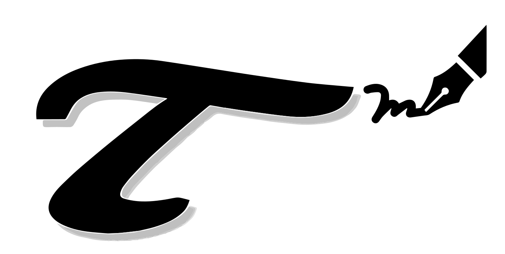

# τ Style

<p align="center">
  
</p>

<p align="center">
  
  
  
  
  
</p>

<p align="center">
  <a href="#english-version">English Version</a>
</p>

<a id="chinese-version"></a>

`τ Style` 是一个用于复用 τ 科研作图和科研报告视觉偏好的 AI Skill。安装后，Codex 或 Claude Code 可以在生成科研绘图、slides 报告和相关视觉输出时调用这套风格规则。

## 适用范围

- 科研数据绘图默认使用 Python/Matplotlib；风格规则保持语言无关，可迁移到 R、MATLAB、Julia、C++/ROOT、Plotly 或 LaTeX/pgfplots。
- 科研 slides 报告支持 Beamer 工作流；当用户选择 Beamer 时，基于 `yangtaogit/tao-slides` 模板生成报告。
- 完整规则文件位于 `references/style-profile.md`、`references/scientific-plotting.md` 和 `references/scientific-slides.md`；Python helper 位于 `scripts/apply_tao_style.py`。

## 科研绘图风格

### 绘图后端与输出

- 默认绘图后端为 Python/Matplotlib。
- 线图和科研图优先保存矢量格式。
- README/web 预览 SVG 可将文字转路径以保证跨机器显示一致；正式可编辑 SVG/PDF 应保留文字，但需要确认目标环境具有对应字体。

### 字体与字号

- 英文字体首选 Helvetica；中文字体首选宋体；数学公式字体使用 Computer Modern。
- 普通坐标轴标题、tick、legend、annotation 尽量不用 Matplotlib mathtext，以保持字体统一。
- 坐标轴标题使用 `9 pt`；tick 数字使用 `8 pt`；legend 使用 `8 pt`。

### 坐标框尺寸与比例

- 单图科研图固定黑色 XY 坐标框的物理尺寸，而不是固定整个 canvas。
- 默认坐标框宽度为 `2.7 in`，默认比例为 `3:2`，即坐标框为 `2.7 in × 1.8 in`。
- 常用比例为 `1:1`、`3:2`、`5:3`。
- 单图导出 canvas 高度默认固定；左侧布局边距初始值为 `0.42 in`。
- 导出 canvas 宽度可以根据 y tick label、Y 轴标题、外置 legend、colorbar、annotation 等外围元素向左或向右自适应扩展，避免裁剪文字，同时保持 XY 坐标框物理尺寸和导出画布高度不变。
- 多图排列不受单图尺寸/比例限制，应根据子图数量、panel 坐标框、排版和数据关系决定。
- 如果目标媒介有明确最终宽度，例如论文栏宽、slides 占位、poster panel 或报告版式，应先确认目标宽度再选择坐标框尺寸和 canvas。

### 坐标轴、tick 与标签

- 默认使用封闭黑色坐标框；上下左右 spine 可见。
- tick 向内；顶部和右侧也显示 tick。
- 坐标轴线宽为 `1.0 pt`；主 tick 线宽为 `1.0`；副 tick 线宽为 `0.5`。
- 默认不使用 grid。
- 单位使用方括号格式 `Quantity [Unit]`，例如 `Bias Voltage [V]`、`Current [A]`。
- base-10 log 主刻度显示为 `10⁻⁶` 这类普通文本上标形式，不使用 Matplotlib mathtext；副 tick 保持可见，除非过于拥挤。

### 三维坐标

- 三维科研图默认使用 Matplotlib 默认的 3D 坐标框、pane 和 grid，包括 `X`、`Y`、`Z` 坐标轴。
- 3D 图默认使用透视投影 `projection="persp"`，保留三面浅灰 pane 背景，pane 颜色为 `#F2F2F2`。
- 3D 网格只显示主 tick 对应的灰色点线，颜色为 `#9E9E9E`，线型为 dotted `":"`，线宽为 `0.2 pt`；不额外添加 pane 边界线或手动画框。
- 3D tick 方向与 2D 坐标统一为向内；Matplotlib 3D 中使用 `inward_factor=0.0`、`outward_factor=0.2`。
- 3D tick 数字和坐标轴标题使用紧凑间距：`tick_pad=-3.0`，`labelpad=-4.0`。字体、字号和普通文本规则使用 τ Style。
- 已知单位时继续使用方括号格式，例如 `X Position [mm]`。
- 三维空间坐标之外的数值可用颜色梯度表示；colorbar 放在图框外右侧，并使用比 2D 图更大的间距。当前 3D example 使用 `pad=0.16`、`fraction=0.035`、`shrink=0.72`。
- 三维图不受单图二维 XY 坐标框尺寸规则约束，应根据视角、数据主体和右侧 colorbar 自适应选择 canvas。

### 颜色

- 默认偏好冷色调、暗蓝、柔和蓝、黑色和灰色。
- 主色板为 deep blue `#2A2F80`、blue `#4378BC`、black `#000000`、gray `#808080`；muted red `#B04A4A` 仅作为低优先级强调色。
- 多曲线或有序数据默认优先使用暗蓝梯度或灰度梯度；暗蓝梯度/colorbar 以 deep blue `#2A2F80` 为基础演变。
- τ 的色板用于需要更强视觉区分或专用 colorbar 的场景：`#2A2F80`、`#3953A5`、`#4378BC`、`#6FCCDE`、`#99CB6F`、`#F6EB14`、`#F67F21`、`#EE2024`、`#7D1415`。
- colorbar 默认放在对应坐标框外右侧，使用竖向布局，并保持黑色外框线宽与坐标轴一致。

### 线条、marker 与 error bar

- 普通连续曲线和拟合曲线默认 line width 为 `1.0 pt`。
- 二维 XY 数据点很密集时优先只用线条表示，避免 marker 挤在一起。
- 多条拟合曲线用颜色加线型区分，默认线型顺序为 solid、dashed、dotted、dash-dot。
- 默认 marker size 为 `3.2 pt`，marker edge width 为 `0.7 pt`。
- 默认 error bar line width 为 `0.6 pt`，cap size 为 `1.6 pt`。

### Legend

- 框内 legend 不加边框。
- 曲线很多或遮挡数据时，将 legend 放到图框外右侧，优先竖向单列排列，并使用与坐标轴一致的黑色 `1.0 pt` 边框。
- 框外单列 legend 超出图框高度范围时，将条目均分为多列，避免 legend 过高。

### 直方图

- 绘制前询问 y 轴使用 raw `Count` 还是归一化 `Probability Density [1/Unit]`。
- 默认使用阶梯状 bin 外轮廓加浅填充色，也就是沿 bin 边界画直方图外框，不是连接各个 bin 中点的折线。
- 只有 bin 宽较大、统计量较低或需要拟合并展示每个 bin 的不确定度时，才使用 marker + errorbar。

## 科研报告 / Slides 风格

- 生成科研 slides 报告时，如果没有指定输出格式，先询问是否使用 Beamer。
- 如果使用 Beamer，基于 `yangtaogit/tao-slides` 模板生成报告：`https://github.com/yangtaogit/tao-slides`。
- 生成前先获取或定位模板，检查模板的 README、示例、主题文件和构建命令；不要凭空假设模板文件名或命令。
- 在模板副本或新的报告项目目录中生成内容，不直接修改模板源，除非明确要求修改模板。
- slides 中的新科研图仍遵守 τ Style 科研绘图规则。

## 绘图风格样例

下面的图片展示科研绘图风格。

### 色系规则总览


<table width="100%">
  <tr>
    <td colspan="2">色板展示</td>
  </tr>
  <tr>
    <td colspan="2"></td>
  </tr>
  <tr>
    <td width="50%">三维曲面图</td>
    <td>4D 数据颜色映射</td>
  </tr>
  <tr>
    <td></td>
    <td></td>
  </tr>
  <tr>
    <td width="50%">XY 离散数据与拟合</td>
    <td>高斯分布样本误差棒</td>
  </tr>
  <tr>
    <td></td>
    <td></td>
  </tr>
  <tr>
    <td width="50%">对数坐标</td>
    <td>多曲线与外置 Legend</td>
  </tr>
  <tr>
    <td></td>
    <td></td>
  </tr>
  <tr>
    <td width="50%">多个直方图填充</td>
    <td>曲线局部放大</td>
  </tr>
  <tr>
    <td></td>
    <td></td>
  </tr>
</table>

## 安装

安装目标是某个 AI 工具 `skills` 目录下的 `tao-style/` 文件夹。安装脚本支持 Codex 和 Claude Code，也支持一次同步到两者。

先克隆仓库并进入目录：

```bash
git clone https://github.com/yangtaogit/tao-style.git
cd tao-style
```

安装到 Codex：

```bash
python3 scripts/install_skill.py --target codex --mode copy --force
```

安装到 Claude Code：

```bash
python3 scripts/install_skill.py --target claude-code --mode copy --force
```

同时安装或更新 Codex 和 Claude Code：

```bash
python3 scripts/install_skill.py --target all --mode copy --force
```

如果需要安装到自定义 Skill 目录，可添加 `--skills-dir /path/to/skills`。如果想先查看将执行的操作，可添加 `--dry-run`。

## 更新

更新已安装的 copy 版本：

```bash
git pull
python3 scripts/install_skill.py --target all --mode copy --force
```

如果使用 `--mode symlink` 安装，通常只需要更新或修改本仓库，因为安装目录会指向当前工作树。

## 使用

在需要作图时，可以显式提到：

```text
请用 $tao-style 生成这张科研图。
```

如果没有显式提到，但任务是生成或修改科研绘图，Skill 会先询问是否采用 τ Style，再根据确认应用风格。Claude Code 中可用 `/tao-style` 直接调用，也可以依赖 `description` 自动触发。

## English Version

<a id="english-version"></a>

`τ Style` is an AI Skill for reusing τ's scientific plotting and scientific report visual preferences. After installation, Codex or Claude Code can apply this style when generating scientific plots, slide reports, and related visual outputs.

## Scope

- Scientific data plots default to Python/Matplotlib. The style rules are language-agnostic and can be ported to R, MATLAB, Julia, C++/ROOT, Plotly, or LaTeX/pgfplots.
- Scientific slide reports support a Beamer workflow. When Beamer is selected, reports are generated from the `yangtaogit/tao-slides` template.
- Detailed rules live in `references/style-profile.md`, `references/scientific-plotting.md`, and `references/scientific-slides.md`. The Python helper lives in `scripts/apply_tao_style.py`.

## Scientific Plotting Style

### Backend and Output

- The default plotting backend is Python/Matplotlib.
- Line plots and scientific figures should prefer vector formats.
- SVGs shown in README/web previews may convert text to paths for cross-machine consistency. Formal editable SVG/PDF output may keep editable text, but the target environment must have the required fonts.

### Fonts and Sizes

- English text should prefer Helvetica; Chinese text should prefer Songti; mathematical expressions use Computer Modern.
- Regular axis labels, tick labels, legends, and annotations should avoid Matplotlib mathtext when possible so the visual style remains consistent.
- Axis labels use `9 pt`; tick labels use `8 pt`; legends use `8 pt`.

### Axes Box Size and Aspect Ratio

- Single-panel scientific plots fix the physical size of the black XY axes box, not the whole canvas.
- The default axes-box width is `2.7 in` with a `3:2` ratio, i.e. `2.7 in × 1.8 in`.
- Common ratios are `1:1`, `3:2`, and `5:3`.
- The exported single-panel canvas height is fixed by default. The initial left layout margin is `0.42 in`.
- The exported canvas width may expand left or right to include y tick labels, y-axis labels, outside legends, colorbars, and annotations without cropping, while preserving the physical XY axes-box size and exported canvas height.
- Multi-panel figures are not constrained by this single-panel rule; choose their canvas and panel boxes according to the number of panels, layout, and data relationships.
- If the target medium has a fixed final width, such as a paper column, slide placeholder, poster panel, or report layout, confirm the target width before choosing the axes-box size and canvas.

### Axes, Ticks, and Labels

- Use a closed black axis box by default; all four spines are visible.
- Ticks point inward; top and right ticks are shown.
- Axis line width is `1.0 pt`; major tick width is `1.0`; minor tick width is `0.5`.
- Grid lines are off by default.
- Units use square brackets, such as `Bias Voltage [V]` and `Current [A]`.
- Base-10 log major ticks should be displayed as plain-text superscripts such as `10⁻⁶`, not Matplotlib mathtext. Minor ticks should remain visible unless they become too crowded.

### 3D Axes

- 3D scientific plots should use Matplotlib's default 3D coordinate box, panes, and grid by default, including the `X`, `Y`, and `Z` axes.
- Use perspective projection by default, `projection="persp"`. Keep the three light-gray 3D pane backgrounds with pane color `#F2F2F2`.
- Show only major-tick grid lines on 3D panes, using gray dotted lines with color `#9E9E9E`, linestyle `":"`, and linewidth `0.2 pt`. Do not add extra pane boundary lines or manual frames.
- Match 2D axes by using inward ticks. In Matplotlib 3D, use `inward_factor=0.0` and `outward_factor=0.2`.
- Use compact 3D label spacing: `tick_pad=-3.0` and `labelpad=-4.0`. Apply τ Style typography: `9 pt` axis labels, `8 pt` tick labels, and ordinary text for regular coordinate labels instead of mathtext.
- When units are known, keep the square-bracket format, such as `X Position [mm]`.
- Use color gradients for scalar values in addition to 3D spatial coordinates; place the colorbar outside the right side of the axes with more padding than 2D plots. The current 3D examples use `pad=0.16`, `fraction=0.035`, and `shrink=0.72`.
- 3D figures are not constrained by the single-panel 2D XY axes-box size rule. Choose the canvas according to the view angle, data body, and right-side colorbar.

### Colors

- The default palette favors cool tones, dark blue, blue, black, and gray.
- The core palette is deep blue `#2A2F80`, blue `#4378BC`, black `#000000`, and gray `#808080`; muted red `#B04A4A` is a low-priority accent color.
- For many curves or ordered data, prefer dark-blue gradients or grayscale gradients by default; the dark-blue gradient/colorbar is derived from deep blue `#2A2F80`.
- The τ palette is available when stronger visual separation or a dedicated colorbar is needed: `#2A2F80`, `#3953A5`, `#4378BC`, `#6FCCDE`, `#99CB6F`, `#F6EB14`, `#F67F21`, `#EE2024`, `#7D1415`.
- Colorbars should be placed outside the right side of the corresponding axes, use a vertical layout, and keep a black outline width matching the axes box.

### Lines, Markers, and Error Bars

- Regular continuous curves and fitted curves default to a line width of `1.0 pt`.
- For dense two-dimensional XY data, prefer line-only plots to avoid overcrowded markers.
- Multiple fitted curves should be distinguished by both color and line style, with the default order solid, dashed, dotted, and dash-dot.
- Default marker size is `3.2 pt`; marker edge width is `0.7 pt`.
- Default error-bar line width is `0.6 pt`; cap size is `1.6 pt`.

### Legends

- Legends inside the plotting box should not have a frame.
- If many curves are present or the legend overlaps the data, place the legend outside the right side of the axes, preferably as a vertical single column, with a black `1.0 pt` frame matching the axis box.
- If an outside single-column legend exceeds the height of the axes box, split the entries evenly into multiple columns to keep the legend compact.

### Histograms

- Before plotting, ask whether the y-axis should be raw `Count` or normalized `Probability Density [1/Unit]`.
- The default histogram style is a stepped bin outline with a light fill, meaning the outline follows bin edges. It is not a line connecting bin centers.
- Use marker + errorbar only for special cases such as wide bins, low statistics, or fitted binned data with uncertainty shown for each bin.

## Scientific Report / Slides Style

- When generating scientific slide reports and no output format is specified, ask whether to use Beamer.
- If Beamer is used, base the report on the `yangtaogit/tao-slides` template: `https://github.com/yangtaogit/tao-slides`.
- Before generating, fetch or locate the template and inspect its README, examples, theme files, and build commands. Do not assume template filenames or build commands without checking.
- Generate content in a copied template or a new report project directory. Do not directly modify the template source unless explicitly requested.
- New scientific figures used in slides should still follow the τ Style scientific plotting rules.

## Plotting Examples

The figures below show the scientific plotting style.

### Color System Overview


<table width="100%">
  <tr>
    <td colspan="2">Palette Display</td>
  </tr>
  <tr>
    <td colspan="2"></td>
  </tr>
  <tr>
    <td width="50%">3D Surface</td>
    <td>4D Data Color Mapping</td>
  </tr>
  <tr>
    <td></td>
    <td></td>
  </tr>
  <tr>
    <td width="50%">XY Data and Linear Fit</td>
    <td>Gaussian Error Bar</td>
  </tr>
  <tr>
    <td></td>
    <td></td>
  </tr>
  <tr>
    <td width="50%">Log Axis</td>
    <td>Many Curves with External Legend</td>
  </tr>
  <tr>
    <td></td>
    <td></td>
  </tr>
  <tr>
    <td width="50%">Multiple Filled Histograms</td>
    <td>Inset Zoom</td>
  </tr>
  <tr>
    <td></td>
    <td></td>
  </tr>
</table>

## Installation

Install the Skill as a `tao-style/` folder under the target AI tool's `skills` directory. The installer supports Codex and Claude Code targets, and can sync to both at once.

Clone the repository and run the installer from the repository root:

```bash
git clone https://github.com/yangtaogit/tao-style.git
cd tao-style
```

Install to Codex:

```bash
python3 scripts/install_skill.py --target codex --mode copy --force
```

Install to Claude Code:

```bash
python3 scripts/install_skill.py --target claude-code --mode copy --force
```

Install or update both Codex and Claude Code:

```bash
python3 scripts/install_skill.py --target all --mode copy --force
```

Use `--skills-dir /path/to/skills` to install to a custom Skill directory. Use `--dry-run` to preview the operation before copying files.

## Updating

To update an installed copy:

```bash
git pull
python3 scripts/install_skill.py --target all --mode copy --force
```

If the Skill was installed with `--mode symlink`, pulling or editing this repository is usually enough because the installed Skill points back to the working tree.

## Usage

When generating a plot, explicitly mention the Skill if needed:

```text
Please use $tao-style to generate this scientific figure.
```

If the Skill is not explicitly mentioned but the task is to generate or revise a scientific figure, the Skill asks whether τ Style should be applied, then uses the style after confirmation. In Claude Code, `/tao-style` can be used directly, or the Skill can be triggered automatically through its `description`.
