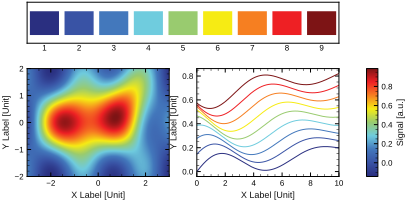

# τ Style

<p align="center">
  
</p>

<p align="center">
  <a href="#chinese-version">Chinese Version / 中文版本</a>
</p>

`τ style` is a personal AI Skill for preserving and reusing τ's plotting and visual-format preferences. The scientific plotting profile is currently maintained, and the scientific report / slides profile has started; future extensions may cover documents, schematic figures, and other visual outputs.

Install this repository into Codex or Claude Code to reuse τ Style when generating scientific plots, slide reports, and related visual outputs.

## Current Scope

The scientific plotting part is provisionally complete. Scientific data plots default to Python/Matplotlib, while the style rules are language-agnostic and can later be ported to R, MATLAB, Julia, C++/ROOT, Plotly, or LaTeX/pgfplots.

The scientific report / slides part is in its early stage. When generating slide reports and no output format is specified, the Skill should ask whether to use Beamer. If Beamer is selected, reports should be based on the `yangtaogit/tao-slides` template.

Detailed rules are maintained in `references/style-profile.md`, `references/scientific-plotting.md`, and `references/scientific-slides.md`. The Python helper is maintained in `scripts/apply_tao_style.py`.

## Confirmed Scientific Plotting Rules

- Fonts: English text should prefer Helvetica; Chinese text should prefer Songti; mathematical expressions use Computer Modern. Regular axis labels, tick labels, legends, and annotations should avoid math fonts when possible so the visual style remains consistent.
- Font sizes: axis labels use `9 pt`; tick labels use `8 pt`; legends use `8 pt`.
- Axes: use a closed black axis box by default; all four spines are visible; ticks point inward; top and right ticks are shown; axis line width is `1.0 pt`; major tick width is `1.0`; minor tick width is `0.5`; grid lines are off by default.
- Axis labels and units: units use square brackets, such as `Bias Voltage [V]` and `Current [A]`.
- Axes box size and aspect ratio: single-panel scientific plots fix the physical size of the black XY axes box, not the whole canvas. The default axes-box width is `3.0 in` with a `3:2` ratio, i.e. `3.0 in x 2.0 in`. Common ratios are `1:1`, `3:2`, and `5:3`. The exported single-panel canvas height is fixed by default. The initial left layout margin is `0.42 in`, but the exported canvas width may expand left or right to include y tick labels, y-axis labels, outside legends, colorbars, and annotations without cropping. Multi-panel figures are not constrained by this single-panel rule; their canvas and panel boxes should be chosen according to the layout, number of panels, and data relationships. If the target medium has a fixed final width, such as a paper column, slide placeholder, poster panel, or report layout, confirm the target width before choosing the axes-box size and canvas.
- Log axes: base-10 log major ticks should be displayed as plain-text superscripts such as `10^-6`, not Matplotlib mathtext. Minor ticks should remain visible unless they become too crowded.
- Colors: prefer cool tones, dark blue, soft blue, black, and gray. The current core palette is Navy `#000080`, soft blue `#6CA6CD`, black `#000000`, gray `#808080`, and muted red `#B04A4A` as a low-priority accent color. An optional bright high-contrast palette is available for stronger visual separation or high-contrast colorbars: `#2A2F80`, `#3953A5`, `#4378BC`, `#6FCCDE`, `#99CB6F`, `#F6EB14`, `#F67F21`, `#EE2024`, `#7D1415`.
- Color gradients: for many curves or ordered data, prefer dark-blue gradients or grayscale gradients by default. Use the bright high-contrast gradient only when a vivid alternative is desired.
- Markers and error bars: default marker size is `3.2 pt`; marker edge width is `0.7 pt`; error-bar line width is `0.6 pt`; cap size is `1.6 pt`.
- Lines and fitting: regular continuous curves and fitted curves default to a line width of `1.0 pt`. For dense two-dimensional XY data, prefer line-only plots to avoid overcrowded markers. Multiple fitted curves should be distinguished by both color and line style, with the default order solid, dashed, dotted, and dash-dot.
- Legends: legends inside the plotting box should not have a frame. If many curves are present or the legend overlaps the data, place the legend outside the right side of the axes as a vertical single column, with a black `1.0 pt` frame matching the axis box.
- Histograms: before plotting, ask whether the y-axis should be raw `Count` or normalized `Probability Density [1/Unit]`. The default histogram style is a stepped bin outline with a light fill, meaning the outline follows bin edges. It is not a line connecting bin centers. Use marker + errorbar only for special cases such as wide bins, low statistics, or fitted binned data with uncertainty shown for each bin.
- Output: line plots and scientific figures should prefer vector formats. SVGs shown in README/web previews may convert text to paths for cross-machine consistency. Formal editable SVG/PDF output may keep editable text, but the target environment must have the required Helvetica-compatible and math fonts.

## Confirmed Scientific Report / Slides Rules

- When generating scientific slide reports and no output format is specified, ask whether to use Beamer.
- If Beamer is used, base the report on the `yangtaogit/tao-slides` template: `https://github.com/yangtaogit/tao-slides`.
- Before generating, fetch or locate the template and inspect its README, examples, theme files, and build commands. Do not assume template filenames or build commands without checking.
- Generate content in a copied template or a new report project directory. Do not directly modify the template source unless explicitly requested.
- New scientific figures used in slides should still follow the τ Style scientific plotting rules.

## Plotting Examples

The figures below show the current scientific plotting style.

<table width="100%">
  <tr>
    <td width="50%">XY Data and Linear Fit</td>
    <td>Gaussian Error Bar</td>
  </tr>
  <tr>
    <td></td>
    <td></td>
  </tr>
  <tr>
    <td width="50%">Log Axis</td>
    <td>Many Curves with External Legend</td>
  </tr>
  <tr>
    <td></td>
    <td></td>
  </tr>
  <tr>
    <td width="50%">Color Gradients</td>
    <td>Bright High-Contrast Palette</td>
  </tr>
  <tr>
    <td></td>
    <td></td>
  </tr>
  <tr>
    <td width="50%">Multiple Filled Histograms</td>
    <td></td>
  </tr>
  <tr>
    <td></td>
    <td></td>
  </tr>
</table>

## Installation

Install the Skill as a `tao-style/` folder under the target AI tool's `skills` directory. The installer supports Codex and Claude Code targets, and can sync to both at once.

Clone the repository and run the installer from the repository root:

```bash
git clone https://github.com/yangtaogit/tao-style.git
cd tao-style
```

Install to Codex:

```bash
python3 scripts/install_skill.py --target codex --mode copy --force
```

Install to Claude Code:

```bash
python3 scripts/install_skill.py --target claude-code --mode copy --force
```

Install or update both Codex and Claude Code:

```bash
python3 scripts/install_skill.py --target all --mode copy --force
```

Use `--skills-dir /path/to/skills` to install to a custom Skill directory. Use `--dry-run` to preview the operation before copying files.

## Updating

To update an installed copy:

```bash
git pull
python3 scripts/install_skill.py --target all --mode copy --force
```

If the Skill was installed with `--mode symlink`, pulling or editing this repository is usually enough because the installed Skill points back to the working tree.

## Usage

When generating a plot, explicitly mention the Skill if needed:

```text
Please use $tao-style to generate this scientific figure.
```

If the Skill is not explicitly mentioned but the task is to generate or revise a scientific figure, the intended behavior is to ask whether τ Style should be applied, then use the style after confirmation. In Claude Code, `/tao-style` can be used directly, or the Skill can be triggered automatically through its `description`.


## Chinese Version

<a id="chinese-version"></a>

`τ style` 是一个个人 AI Skill，用来保存和复用 τ 的作图与视觉格式偏好。当前已经维护科研绘图部分，并开始维护科研报告 / slides 风格；后续可以继续扩展到文档、示意图等其它输出风格。

将本仓库安装到 Codex 或 Claude Code 后，就可以在生成科研绘图、slides 报告和相关视觉输出时复用 τ Style。

## 当前范围

当前科研绘图部分暂时完成，科研数据绘图默认使用 Python/Matplotlib；风格规则保持语言无关，后续可迁移到 R、MATLAB、Julia、C++/ROOT、Plotly 或 LaTeX/pgfplots。

科研报告 / slides 部分刚开始维护。生成 slides 报告时，如果用户没有指定格式，Skill 应先询问是否使用 Beamer；如果使用 Beamer，应基于 `yangtaogit/tao-slides` 模板生成报告。

更完整的规则在 `references/style-profile.md`、`references/scientific-plotting.md` 和 `references/scientific-slides.md` 中维护；Python helper 在 `scripts/apply_tao_style.py` 中维护。

## 已确认科研绘图规则

- 字体：英文首选 Helvetica；中文首选宋体；数学公式字体使用 Computer Modern。普通坐标轴标题、tick、legend、annotation 尽量不用数学字体，以保持字体统一。
- 字号：坐标轴标题 `9 pt`；tick 数字 `8 pt`；legend `8 pt`。
- 坐标轴：默认封闭黑色坐标框；上下左右 spine 可见；tick 向内；顶部和右侧也显示 tick；坐标轴线宽 `1.0 pt`；主 tick 线宽 `1.0`；副 tick 线宽 `0.5`；默认不使用 grid。
- 轴标题和单位：单位使用方括号格式 `Quantity [Unit]`，例如 `Bias Voltage [V]`、`Current [A]`。
- 坐标框尺寸和比例：单图科研图默认固定黑色 XY 坐标框的物理尺寸，而不是固定整个 canvas。默认坐标框宽度 `3.0 in`，默认比例 `3:2`，即坐标框为 `3.0 in × 2.0 in`；常用比例是 `1:1`、`3:2`、`5:3`。单图导出 canvas 高度默认固定；左侧布局边距初始值为 `0.42 in`，但导出的 canvas 宽度可以根据 y tick label、Y 轴标题、外置 legend、colorbar、annotation 等外围元素向左或向右自适应扩展，避免裁剪文字，同时不改变最终导出图中 XY 坐标框的物理尺寸或导出画布高度。多图排列画布不受这个单图尺寸/比例限制，应根据子图数量、panel 坐标框、排版和数据关系决定。如果目标媒介有明确最终宽度，例如论文栏宽、slides 占位、poster panel 或报告版式，应先确认目标宽度再选择坐标框尺寸和 canvas。
- Log 坐标：base-10 log 主刻度显示为 `10⁻⁶` 这类普通文本上标形式，不使用 Matplotlib mathtext；副 tick 保持可见，除非过于拥挤。
- 颜色：偏好冷色调、暗蓝、柔和蓝、黑色、灰色。当前主色板为 Navy `#000080`、soft blue `#6CA6CD`、black `#000000`、gray `#808080`，muted red `#B04A4A` 仅作为低优先级强调色。可选的明亮高对比度配色为 `#2A2F80`、`#3953A5`、`#4378BC`、`#6FCCDE`、`#99CB6F`、`#F6EB14`、`#F67F21`、`#EE2024`、`#7D1415`，用于需要更强视觉区分或高对比度 colorbar 的场景。
- 颜色梯度：多曲线或有序数据默认优先使用暗蓝梯度或灰度梯度；只有需要明亮、高对比度替代方案时才使用这组新梯度。
- Marker 和 error bar：默认 marker size `3.2 pt`，marker edge width `0.7 pt`；error bar line width `0.6 pt`，cap size `1.6 pt`。
- 线条和拟合：普通连续曲线和拟合曲线默认 line width `1.0 pt`；二维 XY 数据点很密集时优先只用线条表示，避免 marker 挤在一起；多条拟合曲线用颜色加线型区分，默认线型顺序为 solid、dashed、dotted、dash-dot。
- Legend：框内 legend 不加边框；曲线很多或遮挡数据时放到图框外右侧，竖向单列排列，并使用与坐标轴一致的黑色 `1.0 pt` 边框。
- 直方图：绘制前必须询问 y 轴使用 raw `Count` 还是归一化 `Probability Density [1/Unit]`。默认使用阶梯状 bin 外轮廓加浅填充色，也就是沿 bin 边界画直方图外框，不是连接各个 bin 中点的折线；只有 bin 宽较大、统计量较低或需要拟合并展示每个 bin 的不确定度时，才使用 marker + errorbar。
- 输出：线图和科研图优先保存矢量格式；README/web 预览 SVG 可将文字转路径以保证跨机器显示一致；正式可编辑 SVG/PDF 应保留文字但需要确认目标环境有对应字体。

## 已确认科研报告 / Slides 规则

- 生成科研 slides 报告时，如果没有指定输出格式，应先询问是否使用 Beamer。
- 如果使用 Beamer，应基于 `yangtaogit/tao-slides` 模板生成报告：`https://github.com/yangtaogit/tao-slides`。
- 生成前应先获取或定位模板，检查模板的 README、示例、主题文件和构建命令，再按实际结构生成；不要凭空假设模板文件名或命令。
- 应在模板副本或新的报告项目目录中生成内容，不直接修改模板源，除非明确要求修改模板。
- slides 中的新科研图仍应遵守 τ Style 科研绘图规则。

## 绘图风格样例

下面的图片展示当前科研绘图风格。

<table width="100%">
  <tr>
    <td width="50%">XY 离散数据与拟合</td>
    <td>高斯分布样本误差棒</td>
  </tr>
  <tr>
    <td></td>
    <td></td>
  </tr>
  <tr>
    <td width="50%">Log 坐标</td>
    <td>多曲线与外置 Legend</td>
  </tr>
  <tr>
    <td></td>
    <td></td>
  </tr>
  <tr>
    <td width="50%">颜色梯度</td>
    <td>明亮高对比度配色</td>
  </tr>
  <tr>
    <td></td>
    <td></td>
  </tr>
  <tr>
    <td width="50%">多个直方图填充</td>
    <td></td>
  </tr>
  <tr>
    <td></td>
    <td></td>
  </tr>
</table>

## 安装

安装目标是某个 AI 工具 `skills` 目录下的 `tao-style/` 文件夹。安装脚本支持 Codex 和 Claude Code，也支持一次同步到两者。

先克隆仓库并进入目录：

```bash
git clone https://github.com/yangtaogit/tao-style.git
cd tao-style
```

安装到 Codex：

```bash
python3 scripts/install_skill.py --target codex --mode copy --force
```

安装到 Claude Code：

```bash
python3 scripts/install_skill.py --target claude-code --mode copy --force
```

同时安装或更新 Codex 和 Claude Code：

```bash
python3 scripts/install_skill.py --target all --mode copy --force
```

如果需要安装到自定义 Skill 目录，可添加 `--skills-dir /path/to/skills`。如果想先查看将执行的操作，可添加 `--dry-run`。

## 更新

更新已安装的 copy 版本：

```bash
git pull
python3 scripts/install_skill.py --target all --mode copy --force
```

如果使用 `--mode symlink` 安装，通常只需要更新或修改本仓库，因为安装目录会指向当前工作树。

## 使用

在需要作图时，可以显式提到：

```text
请用 $tao-style 生成这张科研图。
```

如果没有显式提到，但任务是生成或修改科研绘图，Skill 的设计是先询问是否采用 τ Style，再根据你的确认应用风格。Claude Code 中可用 `/tao-style` 直接调用，也可以依赖 `description` 自动触发。

